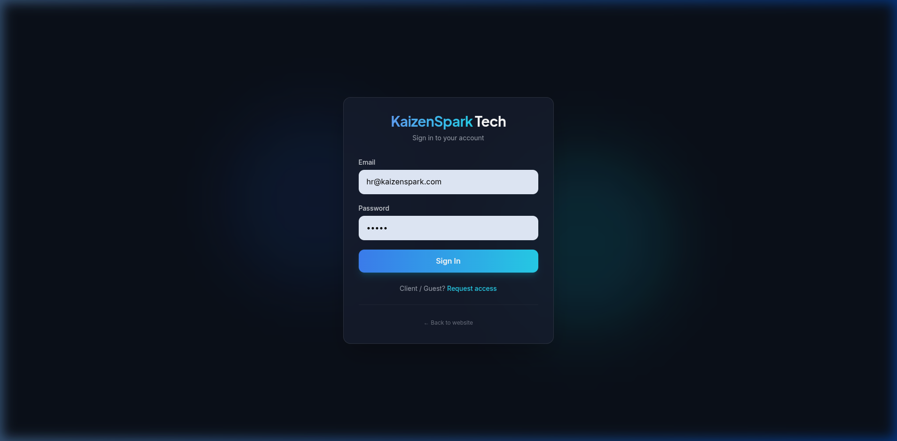
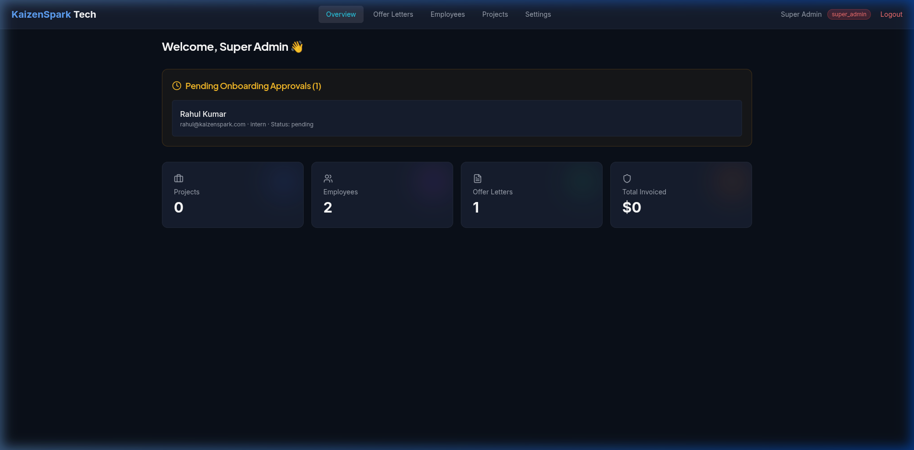
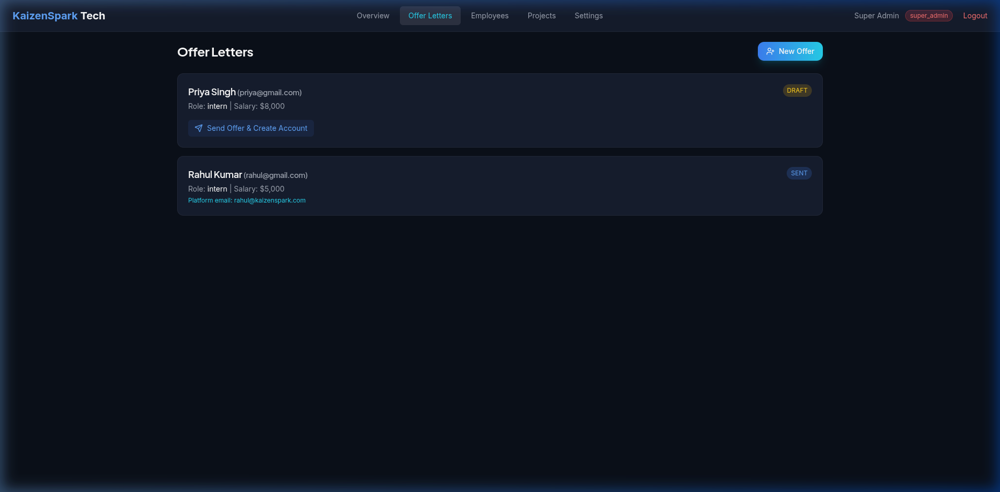
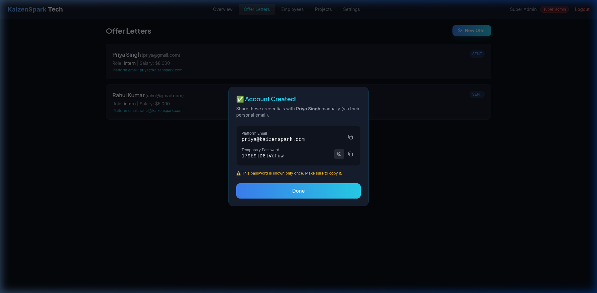
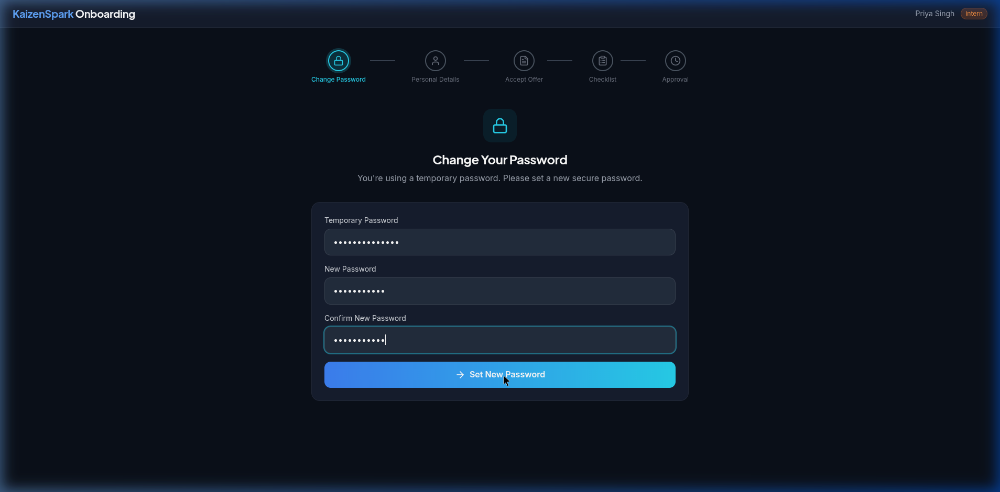

# KaizenSpark Visual Guide

This document provides a visual overview of the platform's core interfaces and workflows.

## 1. Authentication
The unified login page for all users (Admins, HR, Employees, Interns, and Clients).

---

## 2. Super Admin Dashboard
The command center for company owners. View organizational health, pending approvals, and active projects at a glance.

---

## 3. Hiring Workflow: Drafting Offers
Admins can draft offer letters by selecting dynamic Departments and Designations.

---

## 4. Credential Management
After sending an offer or inviting a lead, the platform generates secure, one-time credentials for manual sharing.

---

## 5. Employee Onboarding
Candidates log in to fill out their professional profiles, including links to GitHub, LinkedIn, and personal details.

